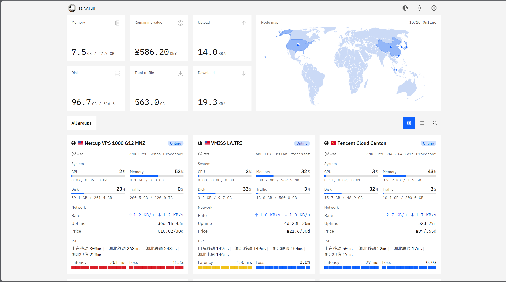
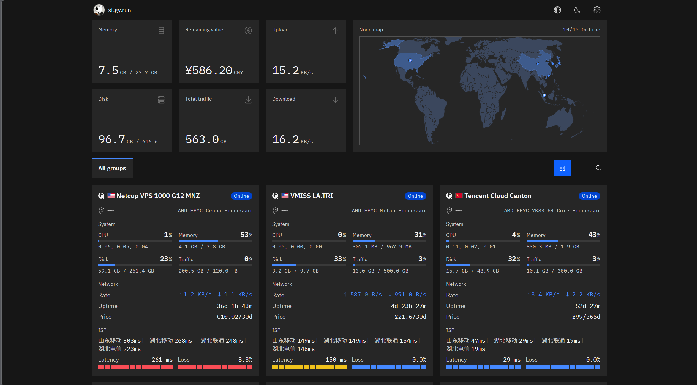

# Komari Carbon

An [IBM Carbon Design System](https://carbondesignsystem.com/) + IBM Plex theme for [Komari Monitor](https://github.com/komari-monitor/komari).

Information density is inspired by Emerald; visuals and components use Carbon tokens / `@carbon/react` only.

[中文](./README.md)

[](https://github.com/gengyue2468/komari-theme-carbon/releases/latest)
[](./LICENSE)
[](https://github.com/komari-monitor/komari)

**Author:** [gengyue2468](https://github.com/gengyue2468)  
**Repository:** https://github.com/gengyue2468/komari-theme-carbon

> Recommended: download the zip from [Releases](https://github.com/gengyue2468/komari-theme-carbon/releases/latest), then upload and enable it in Komari admin → Themes.

## Preview

| Light | Dark |
| --- | --- |
|  |  |

## Features

- **Carbon design language**: `@carbon/react` components + Carbon tokens / SCSS, IBM Plex fonts
- **Realtime monitoring**: RPC2 `common:getNodesLatestStatus` polling (configurable interval), REST fallback
- **Home overview**: stat cards, world map (flag → country centroid + co-location clustering), node cards / table
- **Node detail**: hardware info, billing & remaining value, load / latency history charts
- **Finance popover**: multi-currency conversion and totals (CNY base)
- **i18n**: zh-CN / en, `language` + `appearance` localStorage, compatible with default theme conventions
- **Managed theme settings** (Komari ≥ 1.0.5): default view, uptime, chart hours, density, poll interval, RPC transport
- **Theme package compliance**: `komari-theme.json` + `dist/`, title / description placeholders, footer `Powered by Komari Monitor.`

## Tech stack

| Layer | Choice |
| --- | --- |
| Framework | React 19 + React Router 8 (SPA, `ssr: false`) |
| Language | TypeScript (strict) |
| UI | `@carbon/react`, `@carbon/styles`, `@ibm/plex` |
| Charts | `@carbon/charts-react` |
| State | Zustand (inventory / realtime) + TanStack Query (history) |
| Map | `react-simple-maps` + `country-flag-icons` |
| Data | same-origin `fetch` → `/api/rpc2` + REST |

## Install

1. Open [Latest Release](https://github.com/gengyue2468/komari-theme-carbon/releases/latest)
2. Download `komari-theme-carbon-v*.zip`
3. Komari admin → **Themes** → upload zip → set as active theme

Package layout:

```text
komari-theme-carbon-v0.1.0.zip
├── komari-theme.json
├── preview.png
└── dist/
    ├── index.html
    └── assets/
```

## Local development

Requires **Node.js 22+**, **pnpm**, and a reachable Komari backend.

```bash
pnpm install
pnpm dev
```

By default `/api` and `/favicon.ico` proxy to `https://st.gy.run`. Override the upstream:

```bash
# PowerShell
$env:VITE_PROXY_TARGET="https://your-komari.example"; pnpm dev
```

Or create `.env.development`:

```env
VITE_PROXY_TARGET=https://your-komari.example
```

### Build theme zip

```bash
pnpm release
# equivalent to pnpm build && pnpm package
```

Produces `komari-theme-carbon-v<version>.zip` at the repo root. `scripts/package.mjs` will:

- sync `package.json` version into `komari-theme.json`
- copy `build/client` → `dist/`
- enforce Komari placeholders in `index.html`
- include `komari-theme.json` and optional `preview.png`

### Scripts

| Command | Description |
| --- | --- |
| `pnpm dev` | Dev server |
| `pnpm build` | Production build |
| `pnpm typecheck` | Typecheck |
| `pnpm package` | Package only (build first) |
| `pnpm release` | Build + package |

## Theme settings (managed)

| Key | Type | Default | Description |
| --- | --- | --- | --- |
| `defaultView` | select | `grid` | Home `grid` / `table` |
| `showUptime` | switch | `true` | Show uptime on cards |
| `defaultChartHours` | number | `4` | Default history range on detail (hours) |
| `density` | select | `comfortable` | `comfortable` / `compact` |
| `dataUpdateInterval` | number | `3` | Realtime poll interval in seconds (1–60 recommended) |
| `rpcTransportMode` | select | `websocket` | `websocket` / `http` (falls back on failure) |

Values are exposed via `/api/public` `theme_settings` — **do not** store secrets.

## Compliance checklist

| Requirement | Status |
| --- | --- |
| Root `komari-theme.json` (`name` + `short` as strings) | ✅ |
| `dist/index.html` contains `<title>Komari Monitor</title>` | ✅ |
| Description placeholder `A simple server monitor tool.` | ✅ |
| Footer keeps `Powered by Komari Monitor.` | ✅ |
| Does not own `/admin` or `/terminal` | ✅ |
| SPA routes `/`, `/node/:uuid` | ✅ |
| `configuration.type = managed` | ✅ |
| localStorage `appearance` / `language` | ✅ |

See the [Komari theme development guide](https://www.komari.wiki/en/dev/theme).
## Acknowledgements

- [Komari Monitor](https://github.com/komari-monitor/komari) — backend and theme system
- [IBM Carbon](https://carbondesignsystem.com/) — design system
- Layout density inspired by community themes such as [komari-theme-emerald](https://github.com/Tokinx/komari-theme-emerald)

## License

[MIT](./LICENSE) © gengyue2468
